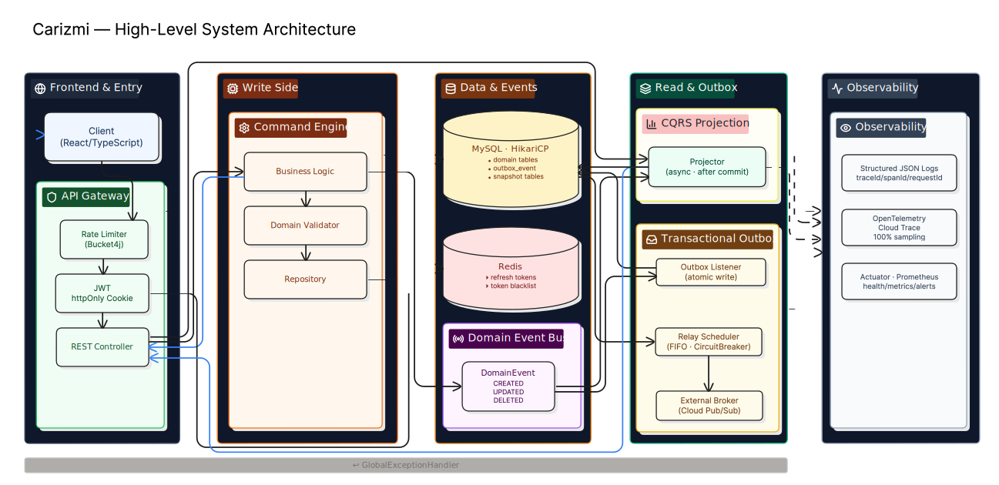

# Carizmi

[](https://openjdk.org/)
[](https://spring.io/projects/spring-boot)
[](https://github.com/mujib-adm/carizmi/actions)
[](https://cloud.google.com/run)
[](./docs/ARCHITECTURE.md)
[](./docs/MONITORING.md)
[](https://owasp.org/)
[](https://codecov.io/gh/mujib-adm/carizmi)

Production-grade open-source community management platform built with Java 21, Spring Boot 3, CQRS architecture, event-driven workflows, and cloud-native infrastructure.

Carizmi was created to provide nonprofit organizations with free access to enterprise-grade operational tooling while serving as a long-term open-source initiative focused on scalable backend engineering, distributed systems architecture, and maintainable platform design.

The platform emphasizes:

- Event-Driven Architecture (EDA)
- CQRS + Transactional Outbox patterns
- Cloud-native deployment workflows
- Observability and operational resilience
- Architectural enforcement and maintainability
- Real-world production reliability

**Current status:** Carizmi is actively deployed in production and currently supports real-world organizational administration, membership management workflows, and financial operations for a Minnesota-based nonprofit community organization, provided completely free of charge.
- **Beneficiary:** Sofumar Community of Minnesota
- **Live In Prod:** [portal.sofumarcommunityofmn.org](https://portal.sofumarcommunityofmn.org/)
</br>*(Are you a non-profit using Carizmi? We would love to feature you here!)*

### Why Carizmi Exists
This open-source initiative was born from a desire to support **non-profit organizations dedicated to community service**. Many nonprofit and community-driven organizations operate on tight budgets with limited technical resources and cannot afford expensive enterprise software platforms or dedicated software engineering teams. Carizmi was created to help bridge that gap.

While the currently implemented domains are intentionally limited in scope, the primary focus of this initial release was to engineer a **rock-solid architectural foundation**. By establishing strict CQRS patterns, event-driven processes, and scalable design, the platform is perfectly positioned for future expansion. The actual scope of the application will continue to evolve alongside our growing community of open-source contributors. The project intentionally prioritizes architectural quality, long-term extensibility, reliability, and operational resilience over rapid feature expansion.

The project’s long-term mission is to provide distributed, event-driven, scalable, maintainable, and modern operational tooling with a modular and extensible foundation that organizations can adopt and customize to manage and automat their community operations and workflows, while simultaneously building an open-source engineering ecosystem focused on sustainable architecture and long-term maintainability.

## Architecture Overview

Carizmi is built on an event-driven, CQRS-based architecture designed for reliability, auditability, and seamless scalability. The high-level diagram below illustrates how a single request flows through the system — from client entry and authentication, through command processing and domain event publication, to asynchronous read-side projection and external event relay.

<p align="center">
  
</p>

> **Frontend & Entry** · **Write Side** · **Data & Events** · **Read & Outbox** · **Observability** — each boundary is independently scalable while maintaining strong transactional guarantees through the Outbox pattern.

## Engineering Highlights

### Distributed Systems & Architecture
- **CQRS architecture** with independent command/query processing.
- **Event-driven asynchronous workflows** using messaging patterns.
- **Transactional Outbox implementation** for reliable event propagation.
- **Bounded-context-oriented modular architecture**.
- **Architectural enforcement mechanisms** using ArchUnit and Java 21 sealed classes.
- **Automated OpenAPI-driven** API with type-safe TypeScript client generation.

### Cloud-Native Platform Engineering
- **Stateless JWT authentication** with Redis-backed refresh token rotation.
- **Production deployment on Google Cloud Run**.
- **Zero-downtime CI/CD delivery workflows**.
- **Infrastructure-oriented observability and distributed tracing**.

### Observability & Reliability
- **OpenTelemetry distributed tracing**.
- **Structured JSON logging** with trace correlation.
- **Micrometer metrics instrumentation**.
- **Prometheus-compatible monitoring architecture**.
- **Operational diagnostics and resilience tooling**.

### DevSecOps & Automation
- **Automated API contract drift detection**.
- **Multi-layer security scanning** with OWASP Dependency-Check, npm audit, Trivy container scanning, and TruffleHog secret detection.
- **GitHub Actions CI/CD pipelines** for zero-downtime deployment.

### Key Architecture Decisions

| Decision                  | Why                                                   |
| ------------------------- | ----------------------------------------------------- |
| CQRS                      | Independent scalability and cleaner domain separation |
| Transactional Outbox      | Reliable async consistency guarantees                 |
| Redis-backed JWT rotation | Distributed session invalidation                      |
| OpenTelemetry tracing     | End-to-end observability                              |
| ArchUnit enforcement      | Prevent architectural drift                           |
| OpenAPI generation        | Contract-driven frontend/backend consistency          |

## Technical Documentation

### Backend Engineering

| Document | Description |
|----------|-------------|
| **[Backend Architecture](docs/ARCHITECTURE.md)** | Overview of the core Java/Spring framework, including domain validation, event lifecycles, and structural enforcement patterns. |
| **[Architectural Scale Upgrade](docs/ARCHITECTURAL_SCALE_UPGRADE.md)** | **[Engineering Highlight]** Comprehensive breakdown of the platform's evolution into a resilient Event-Driven Architecture using CQRS and Outbox patterns. |

### Frontend Engineering

| Document | Description |
|----------|-------------|
| **[UI/UX Architecture](docs/UI_UX_ARCHITECTURE.md)** | Frontend design system, responsive theming engine, and React component architecture. |
| **[API Generation Pipeline](docs/API_GENERATION.md)** | Automated extraction of OpenAPI contracts and type-safe TypeScript client generation. |

### Platform Engineering

| Document | Description |
|----------|-------------|
| **[DevSecOps & CI/CD Pipeline](docs/DEVSECOPS_PIPELINE.md)** | Enterprise GitHub Actions workflow covering continuous integration, security audits, and automated GCP Cloud Run deployments. |
| **[Monitoring & Observability](docs/MONITORING.md)** | Observability stack — health probes, distributed tracing (Cloud Trace), structured logging, alerting strategy, SLOs/SLIs, and operational runbooks. |
| **[Backup and Recovery](docs/BACKUP.md)** | Automated database backup workflows and disaster recovery procedures. |

### DB Migration Strategy

| Document | Description |
|----------|-------------|
| **[Database Migration](docs/DATABASE_MIGRATION.md)** | Strategy for managing database schema evolution using immutable, timestamp-based migrations. |

## Tech Stack

| Layer | Technologies |
|-------|-------------|
| **Backend** | Java 21, Spring Boot 3, Stateless JWT |
| **Frontend** | React 18, TypeScript, Vite, Ant Design, Nginx |
| **Database** | MySQL 8.0 |
| **Cache** | Redis |
| **Infrastructure** | Docker, Docker Compose, GitHub Actions (CI/CD) |
| **API Automation** | Springdoc OpenAPI, Orval, Axios |

## Getting Started

### Prerequisites
- **[Java 21](https://www.oracle.com/java/technologies/downloads/#java21)** (or any compatible OpenJDK distribution)
- **[Docker & Docker Compose](https://www.docker.com/products/docker-desktop/)** (Docker Desktop recommended for macOS/Windows)
- **Node.js 24+** (Auto-installed and managed via the frontend Maven plugin—no local installation required)

### Local Development (Full Stack via Docker)

To bring up the entire application locally in a Docker environment, simply execute the following commands after ensuring your `.env` file is configured:

```bash
# Compile and package the application
./mvnw clean install

# Build containers and bring up the full stack
docker compose build --no-cache && docker compose up
```

### Local Frontend Development (Standalone)

If you are only working on UI/UX and need rapid hot-reloading without rebuilding containers, you can run the frontend independently:

```bash
# Run frontend in a separate terminal
cd frontend && npm install && npm run dev
```

**Accessing the Platform:**
- **Full Stack Frontend (Docker):** http://localhost:8081
- **Full Stack Backend API (Docker):** http://localhost:8080/api
- **Standalone Frontend (npm run dev):** http://localhost:5173/

### Local Environment Setup

The repository includes a [`.env.example`](.env.example) template with all required configuration variables. Copy it to create your local `.env` file before running the platform:

```bash
# 1. Create your local environment file from the template
cp .env.example .env

# 2. Generate a secure JWT signing key and update .env
openssl rand -base64 64
# Copy the output and paste it as the JWT_SECRET value in .env

# 3. (Optional) Customize the remaining values as needed
```

> **⚠️ Important:** The `.env` file contains sensitive credentials and is excluded from version control via `.gitignore`. Never commit it to the repository. All secret values (database passwords, JWT keys) should be replaced with strong, unique values for any non-local environment.

### Environment Variables

The following environment variables configure the platform for local development via Docker Compose and production deployment.

#### 1. Application & Runtime
| Variable | Description | Default |
|----------|-------------|---------|
| `APP_PORT` | HTTP port the backend server listens on | `8080` |
| `SPRING_PROFILES_ACTIVE` | Active Spring profile (`dev` or `prod`) | `dev` |
| `JAVA_OPTS` | JVM memory and tuning flags | `-Xms256m -Xmx512m` |

#### 2. Database
| Variable | Description | Default |
|----------|-------------|---------|
| `DB_NAME` | MySQL database schema name | `carizmi` |
| `DB_USER` | MySQL application username | `carizmi` |
| `DB_PASS` | MySQL application password | `carizmi_pwd` |
| `DB_ROOT_PASS` | MySQL root administrator password | `root_pwd_change_me` |
| `DB_URL` | Full JDBC connection string | `jdbc:mysql://db:3306/${DB_NAME}?useSSL=false...` |

#### 3. Redis (Session & Cache Store)
| Variable | Description | Default |
|----------|-------------|---------|
| `REDIS_HOST` | Redis server hostname | `redis` |
| `REDIS_PORT` | Redis server port | `6379` |

#### 4. Default Admin User (Auto-Provisioned on First Startup)
| Variable | Description | Default |
|----------|-------------|---------|
| `ADMIN_DEFAULT_FIRSTNAME` | First name of the initial admin user | `System` |
| `ADMIN_DEFAULT_LASTNAME` | Last name of the initial admin user | `Administrator` |
| `ADMIN_DEFAULT_EMAIL` | Email address of the initial admin user | `admin@mail.com` |
| `ADMIN_DEFAULT_USERNAME`| Login username for the initial admin | `admin` |

#### 5. Security
| Variable | Description | Default |
|----------|-------------|---------|
| `JWT_SECRET` | Secret key for HS512 JWT signing (min 64 bytes) | *(must be generated)* |

#### 6. Frontend & CORS
| Variable | Description | Default |
|----------|-------------|---------|
| `VITE_API_URL` | Base URL for the frontend API client | `http://localhost:8080/api` |
| `APP_CORS_ALLOWED_ORIGINS` | Comma-separated list of allowed CORS origins | `http://localhost:8081,http://localhost:5173` |

#### 7. Branding (Injected into Frontend at Container Startup)
| Variable | Description | Default |
|----------|-------------|---------|
| `APP_ORG_NAME` | Organization name used throughout the UI | `Your Organization Name` |
| `APP_HEADER_TITLE` | Main header title displayed in the portal | `YOUR ORG` |
| `APP_HEADER_SUBTITLE` | Header subtitle beneath the title | `COMMUNITY PORTAL` |
| `APP_LOGO_ALT` | Alt text for the organization logo | `Organization Logo` |
| `APP_COPYRIGHT` | Footer copyright notice | `© 2026 Your Organization Name.` |

## License

TBD — We are currently evaluating open-source licenses that best align with our mission to provide free software to non-profits while protecting the integrity of the platform. We will update this section once a decision has been made.
