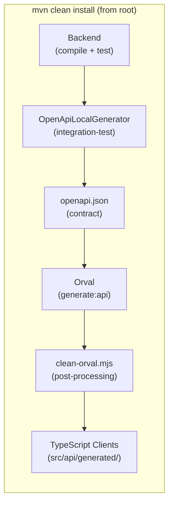
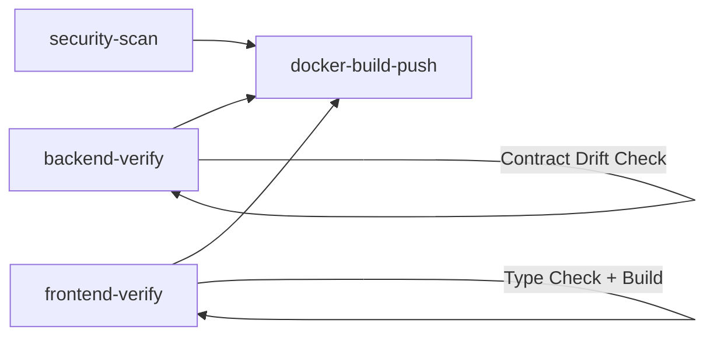

# API Contract & TypeScript Code Generation Architecture

This document describes the end-to-end automation pipeline that extracts the OpenAPI specification from the backend and generates type-safe TypeScript API clients for the frontend.

## Table of Contents
- [Overview](#overview)
- [Technology Stack](#technology-stack)
- [Architecture](#architecture)
- [Phase 1: Contract Generation (Backend → openapi.json)](#phase-1-contract-generation-backend--openapijson)
- [Phase 2: Artifact Generation (openapi.json → TypeScript)](#phase-2-artifact-generation-openapijson--typescript)
- [CI/CD Integration](#cicd-integration)
- [Enum Schema Best Practices](#enum-schema-best-practices)
- [Troubleshooting](#troubleshooting)
- [File Reference](#file-reference)

---

## Overview

The portal uses a **contract-first automation pipeline** that bridges the Spring Boot backend and the React/TypeScript frontend. The pipeline ensures that every REST endpoint, request/response DTO, and enum defined in Java is automatically reflected as a type-safe TypeScript client — eliminating manual API synchronization and preventing contract drift.



---

## Technology Stack

### Backend (Contract Source)

| Library | Version | Purpose |
|---------|---------|---------|
| Spring Boot | 3.5.x (see root `pom.xml`) | Application framework |
| [Springdoc OpenAPI](https://springdoc.org/) | 2.8.13 | Runtime OpenAPI spec generation from Spring MVC controllers |
| [Swagger Annotations](https://github.com/swagger-api/swagger-core) | 2.2.36 (Jakarta) | `@Schema`, `@Operation`, `@Tag` annotations for spec customization |
| [Exec Maven Plugin](https://www.mojohaus.org/exec-maven-plugin/) | 3.5.0 | Runs `OpenApiLocalGenerator` during Maven build |
| [Testcontainers](https://testcontainers.com/) | (managed by Spring Boot BOM) | Provides ephemeral MySQL for spec generation without a local database |

### Frontend (Artifact Consumer)

| Library | Version | Purpose |
|---------|---------|---------|
| [Orval](https://orval.dev/) | ^8.5.3 | Generates TypeScript API clients and types from OpenAPI spec |
| [Axios](https://axios-http.com/) | ^1.13.2 | HTTP client used by generated API functions |
| [Frontend Maven Plugin](https://github.com/eirslett/frontend-maven-plugin) | (in parent BOM) | Runs `npm ci`, `npm run generate:api`, and `npm run build` within Maven |
| Node.js | v24.11.1 | JavaScript runtime (installed by frontend-maven-plugin) |
| npm | 11.6.2 | Package manager (installed by frontend-maven-plugin) |

---

## Architecture

### Module Build Order

The root POM defines three modules built sequentially:

```xml
<modules>
    <module>framework</module>   <!-- 1st: shared abstractions -->
    <module>backend</module>     <!-- 2nd: API + contract generation -->
    <module>frontend</module>    <!-- 3rd: consumes contract, generates clients -->
</modules>
```

This ordering is critical — the backend must finish generating `openapi.json` **before** the frontend's `generate-resources` phase reads it.

### Maven Phase Mapping

| Module | Phase | Action |
|--------|-------|--------|
| `backend` | `compile` | Compiles Java sources (controllers, DTOs, enums) |
| `backend` | `test` | Runs unit tests (Spock) |
| `backend` | `integration-test` | **Runs `OpenApiLocalGenerator`** → writes `frontend/src/api/openapi.json` |
| `frontend` | `generate-resources` | `npm ci` → `npm run generate:api` (Orval + clean-orval.mjs) → `npm run build` |
| `frontend` | `test` | Runs frontend tests |

---

## Phase 1: Contract Generation (Backend → openapi.json)

### How It Works

The contract is generated by [`OpenApiLocalGenerator`](../backend/src/test-integration/java/io/carizmi/integration/tooling/OpenApiLocalGenerator.java), a standalone Java main class that:

1. **Boots the full Spring application** using `SpringApplication.run()` with:
   - `TestContainersConfig` — spins up an ephemeral MySQL container (no local DB required)
   - `--server.port=0` — random port to avoid conflicts
   - `--spring.docker.compose.enabled=false` — disables Docker Compose auto-start
   - `test` profile

2. **Fetches the live OpenAPI spec** from the running instance:
   ```
   GET http://localhost:{random-port}/v3/api-docs
   ```

3. **Pretty-prints and writes** the JSON to `frontend/src/api/openapi.json`

4. **Shuts down** the Spring context gracefully

### Maven Configuration

The generator is wired into the `integration-test` phase via `exec-maven-plugin` in [`backend/pom.xml`](../backend/pom.xml):

```xml
<plugin>
    <groupId>org.codehaus.mojo</groupId>
    <artifactId>exec-maven-plugin</artifactId>
    <executions>
        <execution>
            <id>generate-openapi-json</id>
            <phase>integration-test</phase>
            <goals><goal>exec</goal></goals>
            <configuration>
                <executable>java</executable>
                <classpathScope>test</classpathScope>
                <arguments>
                    <argument>-classpath</argument>
                    <classpath/>
                    <argument>io.carizmi.integration.tooling.OpenApiLocalGenerator</argument>
                </arguments>
                <skip>${skipApiGen}</skip>
            </configuration>
        </execution>
    </executions>
</plugin>
```

> [!IMPORTANT]
> The generator runs during `integration-test`, **not** `test`. Running `mvn install -DskipTests` will still execute the generator because `skipTests` only skips Surefire/Failsafe, not `exec-maven-plugin`. To skip contract generation explicitly, use `-DskipApiGen=true`.

### Swagger Configuration

The [`SwaggerConfig`](../backend/src/main/java/io/carizmi/infrastructure/config/SwaggerConfig.java) bean customizes the spec metadata and security scheme:

```java
@Bean
public OpenAPI customOpenAPI() {
    return new OpenAPI()
        .info(new Info()
            .title("Carizmi Platform API")
            .version("1.0.0")
            .description("Auto-generated. DO NOT EDIT MANUALLY — " +
                    "Changes are overwritten on each build."))
        .addSecurityItem(new SecurityRequirement().addList("bearerAuth"))
        .components(new Components()
            .addSecuritySchemes("bearerAuth",
                new SecurityScheme()
                    .type(SecurityScheme.Type.HTTP)
                    .scheme("bearer")
                    .bearerFormat("JWT")));
}
```

### Output

The generated file is committed to version control at:
```
frontend/src/api/openapi.json
```

This file serves as the **single source of truth** (the "contract") between backend and frontend.

---

## Phase 2: Artifact Generation (openapi.json → TypeScript)

### How It Works

TypeScript type generation is a three-step process triggered by `npm run generate:api`:

#### Step 1: Clean Slate
```bash
rm -rf src/api/generated    # Remove all previously generated files
```

#### Step 2: Orval Code Generation
Orval reads `openapi.json` and generates TypeScript files based on [`orval.config.ts`](../frontend/orval.config.ts):

```typescript
export default defineConfig({
  platform: {
    input: {
      target: './src/api/openapi.json',       // Contract source
    },
    output: {
      target: './src/api/generated/endpoints.ts',
      schemas: './src/api/generated/types',    // DTO types directory
      client: 'axios',                         // HTTP client
      mode: 'tags-split',                      // One file per API tag
      override: {
        mutator: {
          path: './src/api/client/apiMutator.ts', // Custom Axios wrapper
          name: 'apiMutator',
        },
      },
    },
  },
});
```

**Key design decisions:**
- **`mode: 'tags-split'`** — Groups endpoints by controller tag (e.g., `members`, `payments`), producing separate files per API domain
- **`client: 'axios'`** — Generated functions use Axios as the HTTP client
- **Custom mutator** — All requests flow through [`apiMutator.ts`](../frontend/src/api/client/apiMutator.ts) → [`ApiClient.ts`](../frontend/src/api/client/ApiClient.ts), which provides centralized interceptors for auth token refresh, loading state, and error handling

#### Step 3: Post-Processing (`clean-orval.mjs`)

The [`clean-orval.mjs`](../frontend/clean-orval.mjs) script runs automatically via the `postgenerate:api` npm hook. It performs two phases:

**Phase 1 — Type Refactoring:**
1. **GlobalResponse flattening** — Replaces Springdoc's per-entity response wrappers (e.g., `GlobalResponseListMemberDto`) with a generic `GlobalResponse<T>` type
2. **Import rewriting** — Updates all imports to reference the generic wrapper instead of deleted per-entity types
3. **Re-export cleanup** — Removes orphaned `export *` lines from `index.ts`
4. **SortOrder normalization** — Collapses per-entity sort enums (e.g., `MemberSearchRequestDtoSortOrder`) into a single shared `SortOrder` type
5. **Missing import injection** — Adds `SortOrder` imports where references exist but imports are missing

**Phase 2 — Singleton Generation:**
- Creates stable API singleton instances (e.g., `membersApi`, `paymentsApi`) that can be imported directly without hooks, ensuring React components don't re-create API instances on each render

### Output Structure

```
frontend/src/api/
├── openapi.json                    # The contract (committed to git)
└── generated/                      # Auto-generated (gitignored)
    ├── types/
    │   ├── index.ts                # Re-exports all types
    │   ├── memberDto.ts            # Member DTO type
    │   ├── paymentDto.ts           # Payment DTO type
    │   ├── sortOrder.ts            # Shared SortOrder enum
    │   ├── quarterStatus.ts        # QuarterStatus enum
    │   ├── globalResponse.ts       # Generic response wrapper
    │   └── ...                     # Other DTOs and enums
    ├── members/
    │   └── members.ts              # membersApi singleton + functions
    ├── payments/
    │   └── payments.ts             # paymentsApi singleton + functions
    └── ...                         # Other API domains
```

### Maven Configuration

The frontend POM wires the generation into the Maven lifecycle via [`frontend-maven-plugin`](../frontend/pom.xml):

```xml
<!-- Install Node.js and npm -->
<execution>
    <id>install node and npm</id>
    <goals><goal>install-node-and-npm</goal></goals>
</execution>

<!-- Install dependencies -->
<execution>
    <id>npm-ci</id>
    <phase>generate-resources</phase>
    <configuration><arguments>ci</arguments></configuration>
</execution>

<!-- Generate TypeScript clients from openapi.json -->
<execution>
    <id>npm-generate-api</id>
    <phase>generate-resources</phase>
    <configuration><arguments>run generate:api</arguments></configuration>
</execution>
```

---

## CI/CD Integration

The CI/CD pipeline ([`.github/workflows/ci-cd.yml`](../.github/workflows/ci-cd.yml)) enforces contract integrity across two independent jobs:

### Backend Verification (`backend-verify`)

```yaml
- name: Build & Test (Framework + Backend)
  run: mvn -B verify -pl framework,backend
  # Compiles framework → backend → runs unit/integration tests → generates openapi.json

- name: Check for API Contract Drift
  run: |
    if ! git diff --exit-code frontend/src/api/openapi.json; then
      echo "::error::API Contract Drift Detected!"
      echo "::error::Run 'mvn install' locally and commit the updated openapi.json."
      exit 1
    fi
```

> [!CAUTION]
> **Contract Drift Detection** — The CI pipeline regenerates `openapi.json` from the backend code and diffs it against the committed version. If they differ, the build **fails** with a clear error message, ensuring the committed contract always matches the backend code.

### Frontend Verification (`frontend-verify`)

```yaml
- name: Generate API Client
  run: npm run generate:api    # Orval + clean-orval.mjs

- name: Type Check
  run: npm run type-check      # tsc --noEmit

- name: Build Frontend
  run: npm run build
```

The frontend job regenerates clients from the committed `openapi.json` and verifies they compile. This catches:
- **Type mismatches** between generated clients and consuming components
- **Missing imports** after schema changes
- **Breaking API changes** that require frontend updates

### Pipeline Flow



---

## Enum Schema Best Practices

When defining Java enums that should appear as standalone TypeScript types (not inlined), use the `@Schema(enumAsRef = true)` annotation.

### ✅ Correct Pattern

```java
import io.swagger.v3.oas.annotations.media.Schema;

@Schema(enumAsRef = true, description = "Sort direction for paginated queries")
public enum SortOrder {
    asc,
    desc
}
```

**OpenAPI output** — standalone schema with `$ref`:
```json
"SortOrder": { "type": "string", "enum": ["asc", "desc"] }
```

**TypeScript output** — clean, importable type:
```typescript
export const SortOrder = { asc: 'asc', desc: 'desc' } as const;
export type SortOrder = typeof SortOrder[keyof typeof SortOrder];
```

### ❌ Incorrect Patterns

| Pattern | Problem |
|---------|---------|
| No annotation | Enum is **inlined** in the parent DTO, generating names like `QuarterlyCollectionDtoStatus` |
| `@Schema(name = "...")` | Changes the registry name but **does not force `$ref`** extraction |
| `@Schema(implementation = ...)` on the field | Works sometimes but requires annotating **every** field that uses the enum |

### Rule

> [!IMPORTANT]
> **Every Java enum exposed in a DTO must have `@Schema(enumAsRef = true)`.** This is a one-time, enum-level annotation. No field-level annotations are needed — Springdoc will automatically generate `$ref` references wherever the enum is used.

### Current Enum Definitions

| Java Enum | File | Annotation |
|-----------|------|------------|
| `SortOrder` | `shared/data/dto/SortOrder.java` | `@Schema(enumAsRef = true)` |
| `QuarterStatus` | `shared/constants/QuarterStatus.java` | `@Schema(enumAsRef = true)` |

---

## Troubleshooting

### Contract not updating after `mvn clean install`

| Symptom | Cause | Fix |
|---------|-------|-----|
| `openapi.json` unchanged | `-DskipApiGen=true` is set | Run without `-DskipApiGen` |
| Generator logs not visible | Using `-DskipTests` which may skip `integration-test` in some configs | Use `mvn clean install` without skip flags |
| Enum still inlined | Missing `@Schema(enumAsRef = true)` | Add annotation to the enum class |
| `Failed to delete node_modules` | OS file lock (IDE indexing) | Retry, or already fixed — `node_modules` is no longer in the clean plugin filesets |

### TypeScript types not matching

| Symptom | Cause | Fix |
|---------|-------|-----|
| Old type names persist | Stale generated files | Run `npm run generate:api` (deletes `src/api/generated/` first) |
| `GlobalResponseListFooDto` appears | `clean-orval.mjs` didn't run | Check `postgenerate:api` hook in `package.json` |
| Per-entity `SortOrder` duplicates | `clean-orval.mjs` Step 5 didn't match | Check regex patterns in the script |

### CI fails with "Contract Drift Detected"

This means the committed `openapi.json` doesn't match what the backend generates. Fix:
```bash
mvn clean install          # Regenerates openapi.json locally
git add frontend/src/api/openapi.json
git commit -m "Update API contract"
```

---

## File Reference

| File | Location | Purpose |
|------|----------|---------|
| `SwaggerConfig.java` | `backend/src/main/.../infrastructure/config/` | OpenAPI metadata and security scheme |
| `OpenApiLocalGenerator.java` | `backend/src/test-integration/.../integration/tooling/` | Contract extraction utility |
| `TestContainersConfig.java` | `backend/src/test-integration/.../integration/config/` | Ephemeral MySQL for headless spec generation |
| `openapi.json` | `frontend/src/api/` | The API contract (committed to git) |
| `orval.config.ts` | `frontend/` | Orval code generation configuration |
| `clean-orval.mjs` | `frontend/` | Post-processing: type flattening + singleton generation |
| `apiMutator.ts` | `frontend/src/api/client/` | Custom Axios wrapper for generated functions |
| `ApiClient.ts` | `frontend/src/api/client/` | Centralized Axios instance with interceptors |
| `backend/pom.xml` | `backend/` | Maven config for `exec-maven-plugin` (contract gen) |
| `frontend/pom.xml` | `frontend/` | Maven config for `frontend-maven-plugin` (artifact gen) |
| `ci-cd.yml` | `.github/workflows/` | CI/CD pipeline with contract drift detection |
