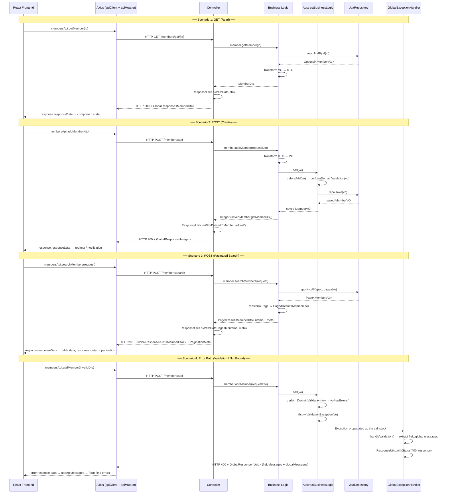
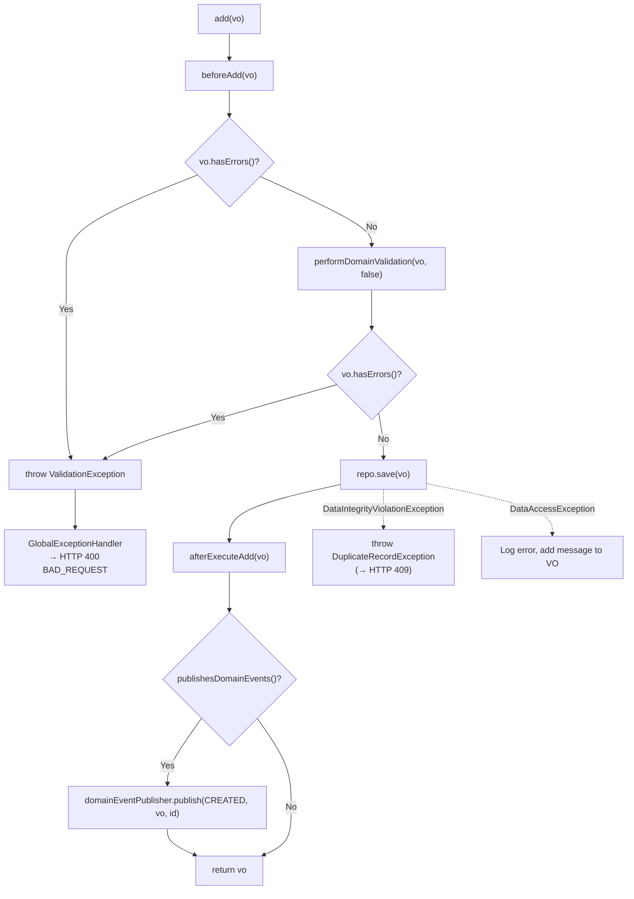
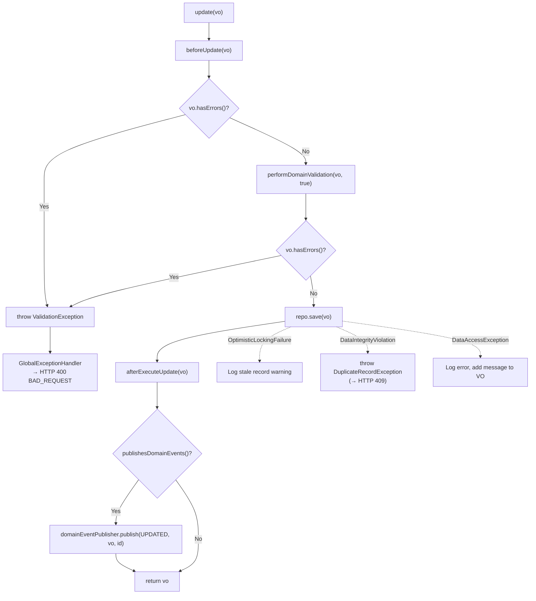
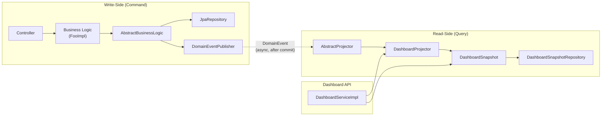
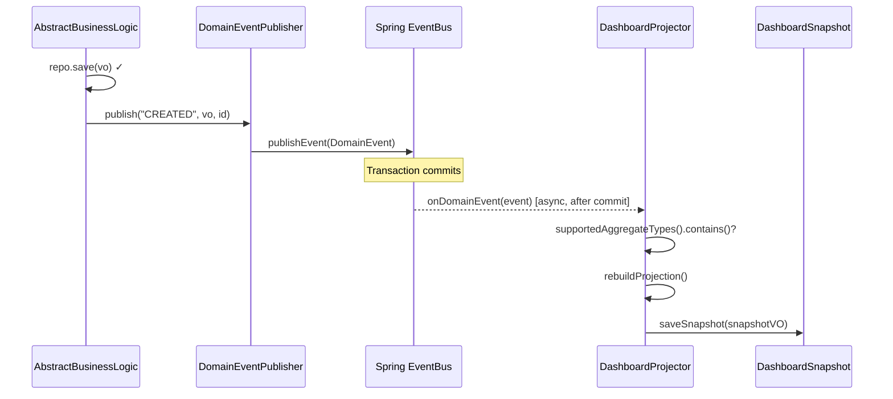
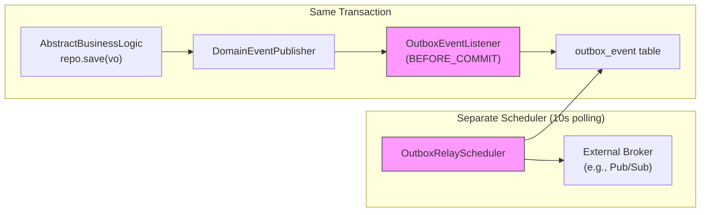
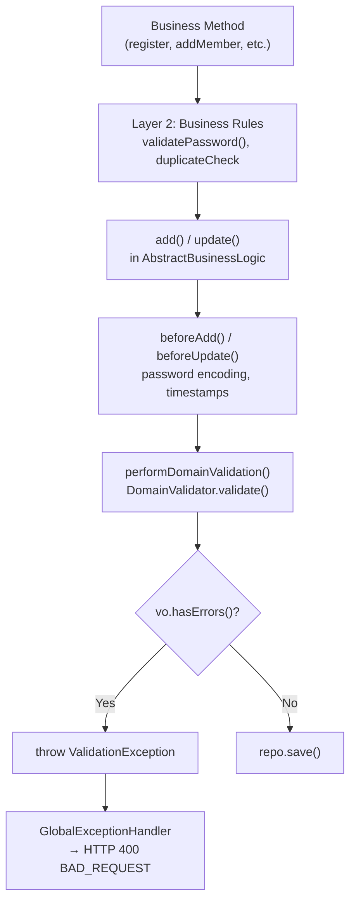

# Backend Architecture

This document describes the core architectural patterns governing business logic, domain validation, event-driven processing, and data integrity in the Carizmi Platform backend.

## Table of Contents
1. [Overview](#1-overview)
2. [End-to-End Request/Response Lifecycle](#2-end-to-end-requestresponse-lifecycle)
3. [Framework-Level Class Hierarchy](#3-framework-level-class-hierarchy)
4. [Domain Ownership Enforcement](#4-domain-ownership-enforcement)
5. [Lifecycle Hook Architecture](#5-lifecycle-hook-architecture)
6. [CQRS Architecture](#6-cqrs-architecture)
7. [Event-Driven Architecture](#7-event-driven-architecture)
8. [Domain Validation Strategy](#8-domain-validation-strategy)
9. [Error Propagation Flow](#9-error-propagation-flow)
10. [How to Create a New Domain Module](#10-how-to-create-a-new-domain-module)

---

## 1. Overview

The Carizmi Platform backend is built on a **framework-driven architecture** that standardizes how domain data is validated, persisted, projected, and protected. The architecture is composed of five core pillars:

1. **Lifecycle-Managed Persistence (Write-Side)** — All create, update, and delete operations flow through `AbstractBusinessLogic`, which enforces a strict hook sequence (`beforeAdd`/`beforeUpdate` → `performDomainValidation` → `save` → `publish DomainEvent`). No code path can bypass this lifecycle.

2. **Domain Rules Enforcement** — The `performDomainValidation()` hook in the Business Logic layer ensures that every entity is validated against its `DomainValidator` before any database operation.

3. **One VO → One Business Logic** — Each Value Object is owned/managed by exactly one Business Logic class, preventing logic fragmentation. Enforced at compile-time, startup, and test-time.

4. **CQRS (Command Query Responsibility Segregation)** — Write operations flow through `AbstractBusinessLogic`; read-side projections are computed asynchronously by `AbstractProjector` subclasses, triggered by domain events after the write transaction commits.

5. **Event-Driven Architecture** — Domain events are published automatically after every successful write operation and consumed in-process by projectors. A Transactional Outbox infrastructure is ready for future external broker integration.

> [!IMPORTANT]
> **No code path may bypass validation.** This includes data loaders, schedulers, and any other code that persists data — they must call `add()`/`update()` on the BL, never `repo.save()` directly.

---

## 2. End-to-End Request/Response Lifecycle

This section documents the complete flow of a request from the React frontend through the Spring Boot backend and back. Every API call in the Carizmi Platform follows this unified lifecycle, ensuring a clean separation of concerns across all architectural layers.

### Architecture Overview

```
┌──────────────────────────────────┐
│        React Frontend            │
│  Orval-generated hooks → state   │
└──────────────┬───────────────────┘
               │ HTTP (JSON)
┌──────────────▼───────────────────┐
│   Axios apiClient / apiMutator   │
│   Interceptors: loading, 401     │
│   refresh, error routing         │
└──────────────┬───────────────────┘
               │
┌──────────────▼───────────────────┐     ┌──────────────────────────────┐
│   Controller (Web Layer)         │     │  GlobalExceptionHandler      │
│   @RestController                │     │  @RestControllerAdvice       │
│   Owns: ResponseEntity,          │     │  Catches domain exceptions → │
│   GlobalResponse, ResponseUtils  │     │  HTTP status + GlobalResponse│
└──────────────┬───────────────────┘     └──────────────────────────────┘
               │ calls
┌──────────────▼───────────────────┐
│   Business Logic (Service Layer) │
│   Returns: T, void, PagedResult  │
│   HTTP-agnostic                  │
└──────────────┬───────────────────┘
               │ delegates
┌──────────────▼───────────────────┐
│   AbstractBusinessLogic          │       ┌────────────────────────────┐
│   Lifecycle hooks → validation → │──────►│   DomainEventPublisher     │
│   save / exception propagation   │ event │   Spring ApplicationEvent  │
└──────────────┬───────────────────┘       └─────────────┬──────────────┘
               │                                         │ async, after commit
┌──────────────▼───────────────────┐       ┌─────────────▼──────────────┐
│   JpaRepository (Data Layer)     │       │   AbstractProjector        │
│   Returns: Entity / VO           │       │   (Read-Side CQRS)         │
└──────────────────────────────────┘       │   Rebuilds snapshot tables │
                                           └────────────────────────────┘
```

### Request/Response Flow

The following sequence diagram traces a complete lifecycle for four key scenarios: a **GET (read)**, a **POST (create)**, a **POST (search with pagination)**, and an **error path** (validation failure).



### Layer Responsibility Matrix

Each layer has a well-defined contract governing what it returns and what it is allowed to know about:

| Layer | Component | Returns | Knows About | Does NOT Know About |
|-------|-----------|---------|-------------|---------------------|
| **Frontend** | React hooks / pages | Typed `GlobalResponse<T>` | `responseData`, `globalMessages`, `fieldMessages`, `meta` | Backend internals |
| **HTTP Client** | `apiClient` + `apiMutator` | `AxiosResponse<GlobalResponse>` | Base URL, cookies, 401 refresh | Business logic |
| **Controller** | `@RestController` | `ResponseEntity<GlobalResponse<T>>` | `ResponseUtils`, HTTP status codes, security annotations | Database, VOs, repositories |
| **Business Logic** | `Foo` interface + `FooImpl` | Domain types: `T`, `void`, `PagedResult<T>` | DTOs, VOs, transformers, validators, domain exceptions | `ResponseEntity`, `GlobalResponse`, HTTP status codes |
| **Framework BL** | `AbstractBusinessLogic` | `V` (ValueObject) | Lifecycle hooks, validation, `JpaRepository` | HTTP, controllers, response formatting |
| **Exception Handler** | `GlobalExceptionHandler` | `ResponseEntity<GlobalResponse<Void>>` | Exception types → HTTP status mapping, `ResponseUtils` | Business logic details |
| **Data Layer** | `JpaRepository` | `Optional<V>`, `Page<V>`, `List<V>` | JPA, database queries | Anything above the repository |

### Design Rules

These rules govern the request/response architecture and prevent layer violations:

| Rule | Description |
|------|-------------|
| **R1 — Domain Return Types** | Business logic interfaces return domain types only (`T`, `List<T>`, `PagedResult<T>`, `void`). They never import `ResponseEntity` or `GlobalResponse`. |
| **R2 — Controller Owns HTTP Translation** | Controllers receive domain results from the business logic layer and wrap them in `ResponseEntity<GlobalResponse<T>>` using `ResponseUtils`. The controller is the **single point** where HTTP status codes and response envelopes are constructed for the happy path. |
| **R3 — Exception-Driven Error Handling** | Errors are communicated via domain exceptions (`ValidationException`, `RecordNotFoundException`, `DuplicateRecordException`, `IllegalStateException`). `GlobalExceptionHandler` translates these into the appropriate HTTP status codes and `GlobalResponse<Void>` envelope. No business logic method ever decides an HTTP status. |
| **R4 — ResponseUtils Boundary** | `ResponseUtils` is used **exclusively** in the controller layer (`@RestController`) and the `GlobalExceptionHandler` (`@RestControllerAdvice`). It never appears in business logic or service implementations. |
| **R5 — Unified Response Envelope** | Every API response — success or error — is wrapped in `GlobalResponse<T>`, providing a consistent contract for the frontend (`responseData`, `globalMessages`, `fieldMessages`, `meta`). |
| **R6 — Fail-Fast Configuration** | System configuration errors (e.g., missing `MEMBERSHIP_FEE` setting) throw `IllegalStateException`, which the `GlobalExceptionHandler` maps to HTTP 503 Service Unavailable. The system never assumes default values for critical configuration. |

### Exception-to-HTTP Status Mapping

The `GlobalExceptionHandler` provides a deterministic mapping from domain exceptions to HTTP responses:

| Exception | HTTP Status | Handler Method | Response Body |
|-----------|-------------|----------------|---------------|
| `MethodArgumentNotValidException` | `400 Bad Request` | `handleMethodArgumentNotValid()` | Field-level validation errors from `@Valid` |
| `ValidationException` | `400 Bad Request` | `handleValidation()` | Field + global messages from `ValueObject`, or plain message string |
| `RecordNotFoundException` | `404 Not Found` | `handleNotFound()` | Error message |
| `DuplicateRecordException` | `409 Conflict` | `handleDuplicate()` | Constraint violation details from `ValueObject` |
| `AuthenticationException` | `401 Unauthorized` | `handleAuthentication()` | Unauthenticated response |
| `AccessDeniedException` | `403 Forbidden` | `handleAccessDenied()` | Access denied response |
| `IllegalStateException` | `503 Service Unavailable` | `handleIllegalState()` | "System configuration error. Please contact support." |
| Any other `Exception` | `500 Internal Server Error` | `handleGeneric()` | "Unexpected error occurred. Please try again or contact support." |

### Frontend Response Handling

The React frontend consumes `GlobalResponse<T>` through Orval-generated API hooks and a centralized Axios client:

```
React Page / Hook
    │
    ├─ Success Path:
    │   response.responseData  → component state (data grid, form, detail view)
    │   response.meta          → pagination controls (page, totalRecords)
    │   response.globalMessages → success notification (Ant Design message)
    │
    └─ Error Path (HTTP 4xx/5xx):
        error.response.data.fieldMessages  → useApiMessages → form field errors
        error.response.data.globalMessages → notification popup
        HTTP 401                           → apiClient interceptor → silent refresh or logout
```

> [!NOTE]
> The frontend's response contract is fully decoupled from backend internals. The `GlobalResponse<T>` envelope is the **sole integration surface**. Backend refactoring that preserves this JSON contract requires zero frontend changes.

---

## 3. Framework-Level Class Hierarchy

### Write-Side — Business Logic Engine

```
                 ┌───────────────────────┐
                 │  BusinessLogic<V>     │  (interface — CRUD contract)
                 │  add, update, delete  │
                 └───────────┬───────────┘
                             │ implements
              ┌──────────────┴──────────────┐
              │  AbstractBusinessLogic<V,R> │  (abstract — lifecycle engine)
              │  hooks, validation, save,   │
              │  domain event publishing    │
              └──────────────┬──────────────┘
                             │ extends
              ┌──────────────┴──────────────┐
              │  FooAbstractBL              │  (sealed — 1:1 binding)
              │  @DomainLogicFor(FooVO)     │
              │  @RepositoryOwnerFor(FooR)  │
              └──────────────┬──────────────┘
                             │ permits (final)
              ┌──────────────┴──────────────┐     ┌─────────────────────────────┐
              │  FooImpl                    │     │  Foo                        │
              │  overrides hooks,           │────▶│  (Service Interface)        │
              │  performDomainValidation,   │     │  Domain-specific methods    │
              │  domain-specific methods    │     │  Injected by all consumers  │
              └─────────────────────────────┘     └─────────────────────────────┘
```

> [!IMPORTANT]
> **Interface-Based Dependency Injection** — All `*Impl` classes are declared `final`
> and proxied via JDK interface-based proxies (`spring.aop.proxy-target-class: false`).
> Consumers must always inject the **service interface** (`Member`, `Payment`, etc.),
> never the concrete class (`MemberImpl`). Injecting a concrete type will cause
> `BeanNotOfRequiredTypeException` at startup.

### Read-Side — CQRS Projection Engine

```
              ┌─────────────────────────────┐
              │  AbstractProjector          │  (abstract — template method)
              │  @TransactionalEventListener│
              │  @Async                     │
              │  onDomainEvent() [final]    │
              └──────────────┬──────────────┘
                             │ extends
              ┌──────────────┴──────────────┐
              │  DashboardProjector         │  (@Component — projection)
              │  supportedAggregateTypes()  │
              │  rebuildProjection()        │
              └─────────────────────────────┘
```

### Event Infrastructure

```
              ┌─────────────────────────────┐
              │  DomainEvent<V>             │  (record — immutable envelope)
              │  eventType, aggregateType,  │
              │  aggregateId, payload       │
              └─────────────────────────────┘
                             │ published by
              ┌──────────────┴──────────────┐
              │  DomainEventPublisher       │  (@Component)
              │  delegates to Spring's      │
              │  ApplicationEventPublisher  │
              └─────────────────────────────┘
```

### Key Components

| Component | Location | Purpose |
|-----------|----------|---------|
| `BusinessLogic<V>` | `framework/.../bl/` | Interface defining `add`, `update`, `delete` |
| `AbstractBusinessLogic<V,R>` | `framework/.../bl/` | Write-side lifecycle engine: hooks → validate → save → publish events |
| `AbstractProjector` | `framework/.../projection/` | Read-side projection engine: event listener → filter → rebuild snapshot |
| `DomainEvent<V>` | `framework/.../event/` | Immutable record: `eventType`, `aggregateType`, `aggregateId`, `payload`, `occurredAt` |
| `DomainEventPublisher` | `framework/.../event/` | Delegates to Spring's `ApplicationEventPublisher` for in-process event delivery |
| `DomainValidator<V>` | `framework/.../bl/` | Validator contract: pure message accumulators, no exception throwing |
| `ValueObject` | `framework/.../vo/` | JPA `@MappedSuperclass` with audit fields and transient error/warning message maps |
| `@DomainLogicFor` | `framework/.../annotation/` | Annotation binding a BL to its VO class |
| `@RepositoryOwnerFor` | `framework/.../annotation/` | Annotation binding a BL to its Repository interface |
| `DomainLogicProcessor` | `framework/.../processor/` | Annotation processor — compile-time 1:1 enforcement |
| `GlobalExceptionHandler` | `framework/.../exception/` | Maps `ValidationException` → 400, `DuplicateRecordException` → 409 |

---

## 4. Domain Ownership Enforcement

Every Value Object must have **exactly one** Business Logic implementation. This contract is enforced at three levels, in order of when they execute:

| Layer          | When             | Mechanism                                          |
|----------------|------------------|----------------------------------------------------|
| **Compile-Time** | `javac`          | `DomainLogicProcessor` (annotation processor)        |
| **Startup**      | `afterPropertiesSet()` | Runtime registry in `AbstractBusinessLogic`   |
| **Test-Time**    | `mvn test`       | `DomainLogicOwnershipRulesSpec` (ArchUnit)         |

### 1. Compile-Time — Annotation Processing (`DomainLogicProcessor`)
During compilation, the processor scans all `@DomainLogicFor` annotations and fails the build if two classes claim the same VO:

```
ERROR: Duplicate Business Logic detected for VO [MemberVO].
       Both [MemberImpl] and [AnotherMemberImpl] are annotated with @DomainLogicFor.
```

### 2. Compile-Time — Sealed Class Hierarchy
Each VO has a dedicated sealed abstract class that only permits its single implementation:

```java
@DomainLogicFor(MemberVO.class)
public abstract sealed class MemberAbstractBL
    extends AbstractBusinessLogic<MemberVO, MemberRepository>
    permits MemberImpl {
    // ...
}

@Service
public final class MemberImpl extends MemberAbstractBL implements Member {
    // domain logic here
}
```

### 3. Startup — Runtime Enforcement (`AbstractBusinessLogic.afterPropertiesSet()`)

On Spring startup, each BL instance is validated against two critical invariants:

| Rule | What It Catches | Error |
|------|----------------|-------|
| **VO → BL Uniqueness** | Two BL beans claiming the same VO type | `IllegalStateException` — duplicate detected |
| **Annotation ↔ Generic Cross-Validation** | `@DomainLogicFor(FooVO)` but generic `<V>` is `BarVO` (copy-paste error) | `IllegalStateException` — mismatch detected |

### 4. Test-Time — Architecture Rules Enforcement (ArchUnit)

Two ArchUnit specs run during `mvn test` to enforce architectural invariants at the structural level:

**`DomainLogicOwnershipRulesSpec`** (6 rules):

| Rule | What It Enforces |
|------|-----------------|
| Package Location | All ABL subclasses reside in `..domain..service..` |
| Annotation Coverage | Every abstract ABL subclass has `@DomainLogicFor` |
| 1-to-1 Uniqueness | Each VO is claimed by exactly one `@DomainLogicFor` |
| Sealed Hierarchy | All `*AbstractBL` classes are declared `sealed` |
| Naming Convention | ABL subclasses end with `*AbstractBL` or `*Impl` |
| Final Impl | All `*Impl` classes are declared `final`, closing the hierarchy |

**`RepositoryOwnershipRulesSpec`** (4 rules):

| Rule | What It Enforces |
|------|-----------------|
| `@RepositoryOwnerFor` Enforcement | Annotated classes only access their declared repository |
| Inbound Access Guard | A repository may only be accessed by its designated owner |
| Outbound Access Guard | `*Impl`/`*AbstractBL` classes may only access their own repository |
| Naming Convention | All `JpaRepository` subinterfaces end with `*Repository` |

### Current Domain Mappings

| Value Object | Sealed Abstract BL | Implementation | Repository Owner | Publishes Events |
|---|---|---|---|---|
| `MemberVO` | `MemberAbstractBL` | `MemberImpl` | `MemberRepository` | ✅ |
| `PaymentVO` | `PaymentAbstractBL` | `PaymentImpl` | `PaymentRepository` | ✅ |
| `ExpenseVO` | `ExpenseAbstractBL` | `ExpenseImpl` | `ExpenseRepository` | ✅ |
| `UserVO` | `UserAbstractBL` | `UserImpl` | `UserRepository` | ❌ |
| `SystemSettingsVO` | `SystemSettingAbstractBL` | `SystemSettingImpl` | `SystemSettingRepository` | ❌ |
| `ReferenceVO` | `ReferenceAbstractBL` | `ReferenceImpl` | `ReferenceRepository` | ❌ |

#### Infrastructure Service Mappings (non-ABL, `@RepositoryOwnerFor` enforced)

| Value Object | Implementation | Repository Owner |
|---|---|---|
| `DashboardSnapshotVO` | `DashboardSnapshotImpl` | `DashboardSnapshotRepository` |
| `OutboxEventVO` | `OutboxEventImpl` | `OutboxEventRepository` |

### Interface-Based Dependency Injection

All `*Impl` classes are declared `final` and all consumers inject via the **service interface** — never the concrete class:

```java
// ✅ Correct — inject by interface
@Autowired private Member member;
@Autowired private Payment payment;

// ❌ Will fail at startup — BeanNotOfRequiredTypeException
@Autowired private MemberImpl member;
@Autowired private PaymentImpl payment;
```

This is enforced by `spring.aop.proxy-target-class: false`, which uses JDK interface-based proxies instead of CGLIB subclass proxies. JDK proxies implement the service interface and delegate to the `final` bean — no subclassing required.

| Service Interface | Final Implementation |
|---|---|
| `Member` | `MemberImpl` |
| `Payment` | `PaymentImpl` |
| `Expense` | `ExpenseImpl` |
| `User` | `UserImpl` |
| `SystemSetting` | `SystemSettingImpl` |
| `Reference` | `ReferenceImpl` |

---

## 5. Lifecycle Hook Architecture

`AbstractBusinessLogic.add()` and `update()` follow a strict hook sequence. No step can be skipped.

### `add(vo)` Lifecycle



### `update(vo)` Lifecycle



### Available Hooks

| Hook | When | Use Case | Default |
|------|------|----------|---------|
| `beforeAdd(vo)` | Before validation on add | Encode passwords, set defaults | No-op |
| `beforeUpdate(vo)` | Before validation on update | Encode passwords, set timestamps | No-op |
| `performDomainValidation(vo, isUpdate)` | After hooks, before save | Delegate to `DomainValidator` | No-op |
| `afterExecuteAdd(vo)` | After successful save | Post-processing, audit | No-op |
| `afterExecuteUpdate(vo)` | After successful save | Post-processing, audit | No-op |
| `publishesDomainEvents()` | Checked after successful save | Opt-in to event-driven flows | `false` |

---

## 6. CQRS Architecture

The platform implements **Command Query Responsibility Segregation (CQRS)** by separating write-side operations from read-side projections:



### Write-Side (`AbstractBusinessLogic`)

- Governs all `add()`, `update()`, and `delete()` operations
- Enforces validation lifecycle, exception handling, and singleton registry
- Publishes `DomainEvent` records after successful persistence (opt-in via `publishesDomainEvents()`)

### Read-Side (`AbstractProjector`)

- Receives `DomainEvent` instances via `@TransactionalEventListener(phase = AFTER_COMMIT)`
- Executes `@Async` — never blocks the write-side thread
- Template method pattern: `onDomainEvent()` is `final`; subclasses implement `rebuildProjection()`
- Filters events by `supportedAggregateTypes()` — only relevant events trigger a rebuild

### Dashboard Projection Example

`DashboardProjector` is the first concrete implementation of `AbstractProjector`. It:
1. Listens for `PaymentVO`, `ExpenseVO`, and `MemberVO` events
2. Queries all relevant domain services to compute metrics
3. Serializes quarterly collections to JSON
4. Persists the result as a single-row `DashboardSnapshotVO` in `dashboard_metrics_snapshot`
5. Uses `@Transactional(propagation = REQUIRES_NEW)` to guarantee snapshot visibility

---

## 7. Event-Driven Architecture

### Phase 1: In-Process Spring Events (Active)

Domain events flow through Spring's `ApplicationEventPublisher` within the same JVM:



### Phase 2: Transactional Outbox (Infrastructure Ready)

A complete Transactional Outbox infrastructure is implemented and **dormant by default**. It activates when `carizmi.outbox.relay.enabled=true`:



| Component | Activation | Role |
|-----------|-----------|------|
| `OutboxEventListener` | `carizmi.outbox.relay.enabled=true` | Persists `DomainEvent` to `outbox_event` table atomically within the domain transaction |
| `OutboxRelayScheduler` | `carizmi.outbox.relay.enabled=true` | Polls for unprocessed events every 10s, relays to external broker, marks as processed |
| `OutboxEventVO` | Always available | JPA entity mapping the `outbox_event` table |
| Circuit Breaker | Resilience4j `@CircuitBreaker` | If broker is unavailable, events stay safely in the outbox table until recovery |

> [!NOTE]
> The in-process event flow (Phase 1) works independently of the outbox. Phase 2 adds **at-least-once delivery** to external consumers without modifying any existing code.

## 8. Domain Validation Strategy

Validation is split into two layers to handle domain-specific concerns:

### Layer 1 — Framework Validation (`performDomainValidation`)

Runs automatically within the `add()`/`update()` lifecycle. Validators implement `DomainValidator<V>`:

```java
// Validator — pure message accumulator, never throws
@Component
public class MemberValidator implements DomainValidator<MemberVO> {
    @Override
    public void validate(MemberVO vo) {
        if (isBlank(vo.getFirstName())) {
            vo.addFieldMessage("firstName", REQUIRED_FIELD);
        }
        // ... more field checks
    }

    @Override
    public void validateForUpdate(MemberVO vo) {
        if (vo.getMemberID() == null) {
            vo.addFieldMessage("memberID", REQUIRED_FIELD);
        }
        validate(vo);  // reuse common checks
    }
}

// BL — delegates to validator
@Override
protected void performDomainValidation(MemberVO vo, boolean isUpdate) {
    if (isUpdate) {
        validator.validateForUpdate(vo);
    } else {
        validator.validate(vo);
    }
}
```

> [!NOTE]
> Validators **never throw exceptions**. They add error messages to the VO via `vo.addFieldMessage()` and `vo.addGlobalMessage()`. The framework checks `vo.hasErrors()` and throws `ValidationException` automatically.

### Layer 2 — Business Rule Validation (Pre-Lifecycle)

Some validations must occur **before** the VO enters the lifecycle (before hooks process data). These are called explicitly in business methods:

```java
// In UserImpl.register()
validator.validatePassword(vo);   // ← Layer 1: plaintext regex check
add(vo);                          // ← Layer 2: lifecycle takes over
```

Examples of Layer 2 validations:
- **Password regex** — must validate plaintext before `beforeAdd()` encodes it
- **Duplicate payment check** — must query DB before attempting save
- **Old password match** — must verify before allowing password update

### Validation Architecture Summary



---

## 9. Error Propagation Flow

The `ValueObject` acts as an error accumulator with two message channels:

| Channel | Method | Scope |
|---------|--------|-------|
| **Field Messages** | `vo.addFieldMessage(field, message)` | Per-field errors (e.g., "First name is required") |
| **Global Messages** | `vo.addGlobalMessage(message)` | Record-level messages (e.g., "Record added successfully") |

When `vo.hasErrors()` is `true` after validation, `AbstractBusinessLogic` throws `ValidationException(vo)`, which is intercepted by `GlobalExceptionHandler`:

| Exception | HTTP Status | Handler |
|-----------|-------------|---------|
| `ValidationException` | `400 BAD_REQUEST` | `handleValidation()` — returns field + global messages |
| `DuplicateRecordException` | `409 CONFLICT` | `handleDuplicate()` — returns constraint violation details |
| `RecordNotFoundException` | `404 NOT_FOUND` | `handleNotFound()` |
| Any other `Exception` | `500 INTERNAL_SERVER_ERROR` | `handleGeneric()` — logs full stack trace |

---

## 10. How to Create a New Domain Module

Follow these steps to add a new domain entity (e.g., `Invoice`). All files go under `io.carizmi.domain.<domain>/` (e.g., `domain/finance/`):

### Step 1: Create the Value Object
**Location**: `domain/<domain>/model/InvoiceVO.java`
```java
@Entity @Table(name = "invoice")
public class InvoiceVO extends ValueObject {
    @Id @GeneratedValue
    private Integer invoiceID;
    // ... domain fields
    @Override public String getTableName() { return "invoice"; }
}
```

### Step 2: Create the Repository
**Location**: `domain/<domain>/repository/InvoiceRepository.java`
```java
public interface InvoiceRepository extends JpaRepository<InvoiceVO, Integer> { }
```

### Step 3: Create the Sealed Abstract BL
**Location**: `domain/<domain>/service/InvoiceAbstractBL.java`
```java
@DomainLogicFor(InvoiceVO.class)
@RepositoryOwnerFor(InvoiceRepository.class)
public abstract sealed class InvoiceAbstractBL
    extends AbstractBusinessLogic<InvoiceVO, InvoiceRepository> permits InvoiceImpl {

    protected InvoiceAbstractBL(InvoiceRepository repo) { super(repo); }

    @Override
    protected Integer getId(InvoiceVO vo) {
        return vo.getInvoiceID();
    }

    // Optional: override to opt-in to domain event publishing.
    // When enabled, CREATED/UPDATED/DELETED events are published after
    // every successful write operation — triggering projectors and the
    // outbox relay (if active). Default is false (no events published).
    @Override
    protected boolean publishesDomainEvents() {
        return true;
    }
}
```

### Step 4: Create the Service Interface
**Location**: `domain/<domain>/service/Invoice.java`
```java
public interface Invoice {
    InvoiceVO add(InvoiceVO vo);
    InvoiceVO update(InvoiceVO vo);
    void delete(InvoiceVO vo);
    // Domain-specific query methods
}
```

> [!IMPORTANT]
> This interface is what all consumers inject. Never inject the `*Impl` class directly.

### Step 5: Create the Validator
**Location**: `domain/<domain>/validation/InvoiceValidator.java`
```java
@Component
public class InvoiceValidator implements DomainValidator<InvoiceVO> {
    @Override
    public void validate(InvoiceVO vo) {
        // Add field messages — never throw
    }
}
```

### Step 6: Create the Implementation
**Location**: `domain/<domain>/service/InvoiceImpl.java`
```java
@Service
public final class InvoiceImpl extends InvoiceAbstractBL implements Invoice {
    private final InvoiceValidator validator;

    @Override
    protected void performDomainValidation(InvoiceVO vo, boolean isUpdate) {
        if (isUpdate) validator.validateForUpdate(vo);
        else validator.validate(vo);
    }

    // Override hooks if needed: beforeAdd(), beforeUpdate()
}
```

### Step 7: Create DTOs and Transformer
**Location**: `domain/<domain>/data/dto/InvoiceDto.java`, `domain/<domain>/data/transformer/InvoiceDtoTransformer.java`

### Step 8: Create the Controller
**Location**: `domain/<domain>/controller/InvoiceController.java`

```java
@RestController
@RequiredArgsConstructor
public class InvoiceController {
    private final Invoice invoice;  // ← inject by interface, never InvoiceImpl
}
```

### Step 9: Verify
Run `mvn test` — the ArchUnit specs will automatically verify 1:1 mapping, repository ownership, sealed hierarchy, final impl, and naming convention compliance.
