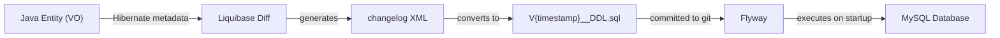
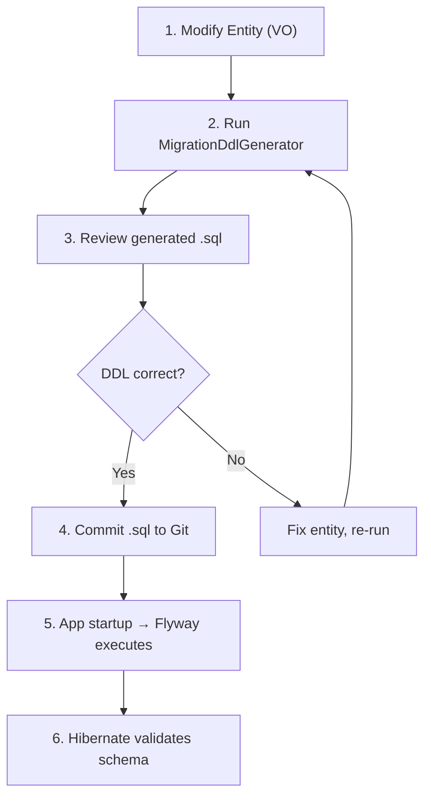

# Database Migration Strategy

This document describes the hybrid database schema management strategy used by the Carizmi Community Platform, combining Liquibase for diff generation and Flyway for safe, versioned execution.

## Table of Contents
- [Overview](#overview)
- [The Strategy](#the-strategy)
- [Versioning: Timestamp-based](#versioning-timestamp-based)
- [Workflow: How to Manage Schema Changes](#workflow-how-to-manage-schema-changes)
- [Safety & Baseline](#safety--baseline)
- [File Reference](#file-reference)

---

## Overview

Schema changes in a production system must be **repeatable, auditable, and safe**. This project uses a **Hybrid Approach** that leverages the strengths of two industry-standard tools:

| Tool | Role | Strength |
|------|------|----------|
| **Liquibase** | Diff generation | Automatically detects differences between Java entities (Hibernate) and the live database schema |
| **Flyway** | Migration execution | Versioned, ordered script execution with checksum validation and audit trail |



---

## The Strategy

### Generation (Liquibase)

Liquibase's diff engine compares the **Hibernate entity metadata** (your Java `@Entity` classes) against the **live database schema** and generates a changelog of the differences.

This is handled by [`MigrationDdlGenerator.java`](../backend/src/main/java/io/carizmi/infrastructure/bootstrap/MigrationDdlGenerator.java), which:

1. Boots a minimal Spring context with the `liquibase-diff` profile
2. Connects to the local MySQL database via [`JpaLiquibaseConfig`](../backend/src/main/java/io/carizmi/infrastructure/bootstrap/JpaLiquibaseConfig.java)
3. Runs Liquibase diff (Hibernate metadata vs live DB)
4. Outputs `generated-changelog.xml` (temporary) → converts to a versioned `.sql` file

### Execution (Flyway)

Flyway reads all `.sql` files from `backend/src/main/resources/db/migration/` and executes them **in version order** on application startup. It tracks every script in a `flyway_schema_history` table to ensure:

- Scripts are run **exactly once**
- Scripts are run in the **correct order**
- The database schema **matches the code**

---

## Versioning: Timestamp-based

We use **Timestamp-based Versioning** (`VYYYYMMDDHHMMSS__Description.sql`) instead of sequential integers (`V1`, `V2`).

| Benefit | Description |
|---------|-------------|
| **Conflict-Free** | Distributed teams can generate migrations independently without fear of collision (e.g., two devs creating `V00005`) |
| **Chronological** | Scripts naturally sort by creation time |
| **Scalable** | No manual version tracking required |

**Example**: `V20260415183000__DDL.sql`

---

## Workflow: How to Manage Schema Changes

### Step-by-Step

1. **Modify Code** — Update your Java Entity / VO class (e.g., add `private String newField;` in `MemberVO.java`)

2. **Generate Migration** — Run the `MigrationDdlGenerator` tool locally
   - **Command**: Run the main class `io.carizmi.infrastructure.bootstrap.MigrationDdlGenerator`
   - **Output**: Generates `generated-changelog.xml` (temporary) → final SQL file at:
     ```
     backend/src/main/resources/db/migration/V20260101120000__DDL.sql
     ```

3. **Review** — Open the generated `.sql` file. Verify the DDL matches your intent.

4. **Commit** — Check the `.sql` file into Git.
   - *Note*: The `generated-changelog.xml` is automatically ignored by Git (`.gitignore`).

### Workflow Diagram



---

## Safety & Baseline

### Baseline Schema

`V1__DB_Schema_Baseline.sql` is the **baseline** schema. It creates the initial state of the database — all tables, indexes, constraints, and seed data.

### Critical Rules

> [!CAUTION]
> **NEVER modify a committed migration file.** Modifying an existing file will cause checksum validation failures in Flyway and break deployments. **Always** create a NEW migration file for any changes.

> [!IMPORTANT]
> **Schema validation on startup.** Hibernate validates that the database schema matches the entities (`spring.jpa.hibernate.ddl-auto=validate`). If a migration hasn't been run, the app will fail to start — preventing data corruption caused by schema drift.

---

## File Reference

| File | Location | Purpose |
|------|----------|---------|
| `MigrationDdlGenerator.java` | `backend/.../infrastructure/bootstrap/` | Liquibase diff → SQL generation tool |
| `JpaLiquibaseConfig.java` | `backend/.../infrastructure/bootstrap/` | DataSource + JPA config for `liquibase-diff` profile |
| `V1__DB_Schema_Baseline.sql` | `backend/src/main/resources/db/migration/` | Initial database schema |
| `application.yml` | `backend/src/main/resources/` | Flyway + Hibernate validation config |
| `generated-changelog.xml` | `backend/src/main/resources/db/migration/` | Temporary Liquibase output (gitignored) |
