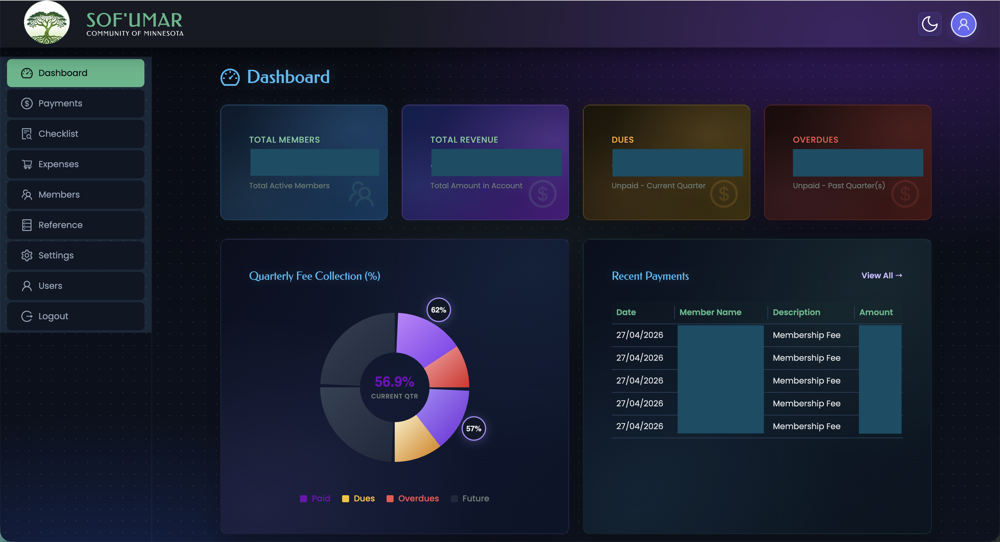
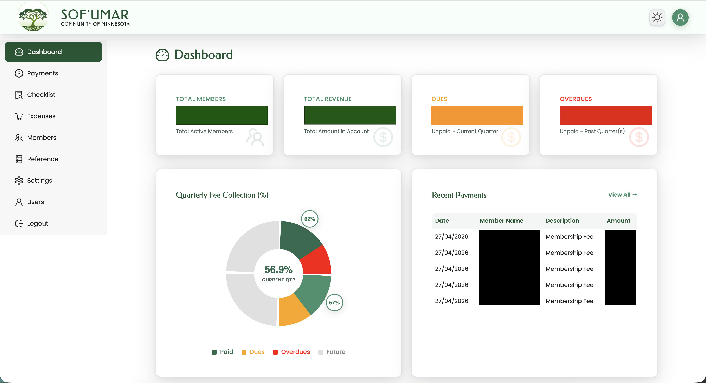
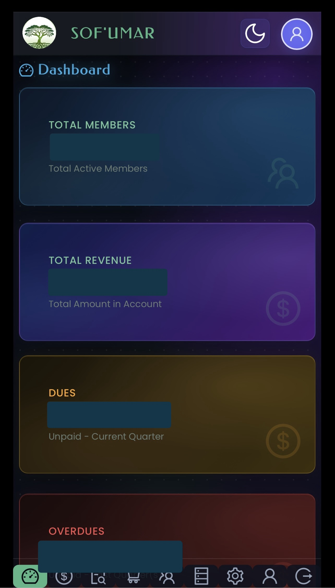
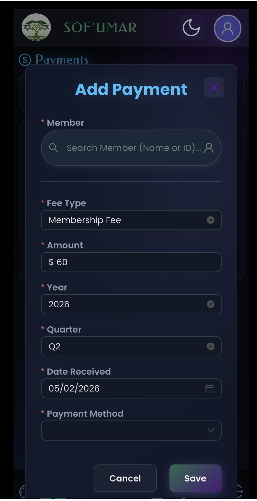
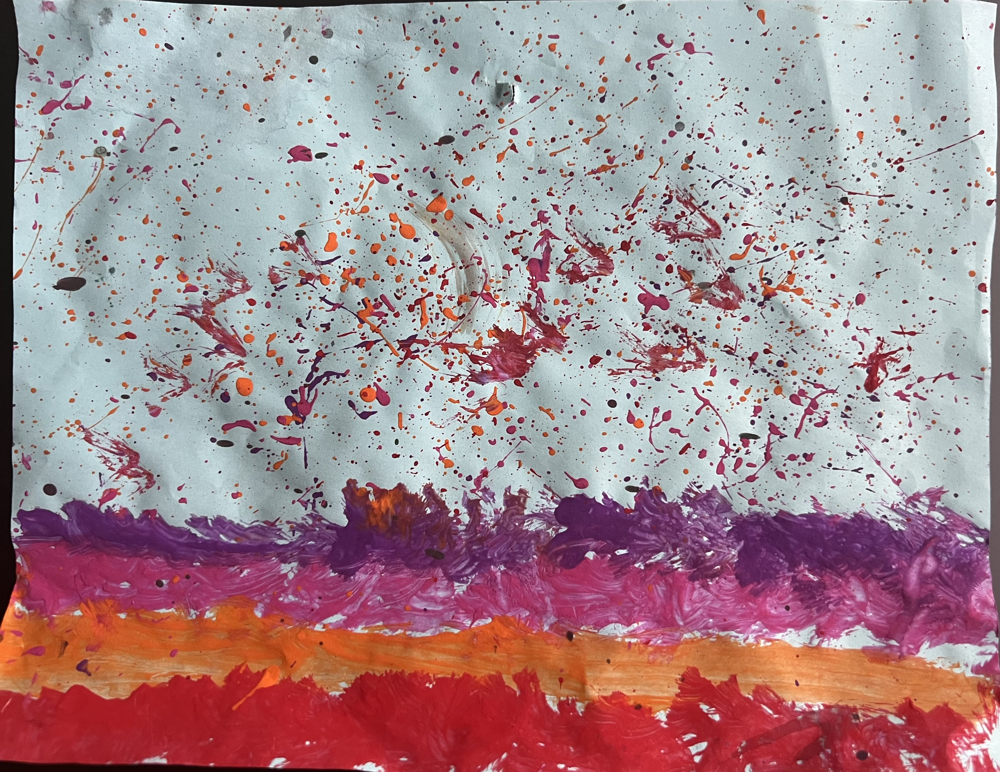

# UI/UX Architecture — Carizmi Community Platform

A comprehensive guide to the frontend architecture, design system, and user experience patterns powering the Carizmi Community Platform. This document is divided into two primary sections: the **Visual UX & End-User Experience** and the underlying **Technical Frontend Architecture**.

---

## Part 1: Visual UX & End-User Experience

### 1. Visual Design Showcase & Theming

The platform features a premium, modern interface designed to provide an exceptional user experience across all devices. A core feature is the robust, zero-flicker dark and light theme engine.

#### Dashboard — Dark Theme
The dashboard showcases the full dark-mode experience: ambient radial gradients as background, glowing metric cards with unique color identities, and a dot-grid texture overlay with a subtle `twinkle` animation.

<p align="center">
  
</p>

**Design highlights:**
- **Metric cards** with per-card gradient backgrounds (blue/teal for Members, purple for Revenue, amber for Dues, crimson for Overdues) using `data-metric` attribute selectors.
- **Dot-grid texture** overlay via `radial-gradient` pseudo-element with `twinkle` animation.
- **Ambient background** composed of three layered `radial-gradient` ellipses (purple, blue, green).
- **Glowing text** with `text-shadow` on page titles and chart titles.

#### Dashboard — Light Theme
The same dashboard in light mode demonstrates seamless theme switching. The brand's green palette takes centre stage with clean white surfaces and subtle depth shadows.

<p align="center">
  
</p>

**Design highlights:**
- Clean white `glass-card` surfaces with `rgba(255, 255, 255, 0.92)` background.
- Green brand palette (`#1e5631` primary, `#40916c` light, `#5c9013` accent).
- Subtle `box-shadow` depth hierarchy instead of dark-mode glow effects.
- Smooth `0.3s ease` colour transitions between theme switches.

### 2. Mobile-First Responsive Design

Carizmi is engineered for full mobile compatibility, scaling flawlessly down to screens as small as **320px**. The mobile experience prioritizes essential content, vertical layouts, and touch-friendly interactions, ensuring fast loading and usability on small devices.

#### Mobile View Adaptation
On small devices (specifically targeting the `< 576px` media query breakpoint), the interface intelligently adapts to maximize screen real estate.

<p align="center">
  
  &nbsp;&nbsp;&nbsp;&nbsp;
  
</p>

**Mobile UX highlights:**
- **Collapsible Search Filters:** The `SearchFilterBar` transitions from a rigid inline layout to a collapsible, vertical-first drawer, saving critical vertical space.
- **Optimized Data Grids:** Non-critical table columns are omitted entirely on small screens, eliminating horizontal overflow and focusing purely on the most essential entity data.
- **Vertical-First Flow:** All complex grid layouts stack vertically, with container padding dynamically reduced (`2rem → 1rem → 0.5rem`) to maximize the content area.
- **Touch Optimization:** Touch targets are preserved, and hardcoded pixel widths are completely removed in favor of fluid, relative units.

### 3. The Spark of Inspiration: Reimagining the Dark Theme

Great enterprise software doesn't have to be visually sterile. The dark theme you see today actually began as a standard, utilitarian blackout theme—a very common, albeit uninspiring, pattern in B2B applications. 

The turning point for the design was completely serendipitous. The creator's first-grade daughter came home with a reading fluency assignment and, on the back of it, had created a vibrant painting using striking bands of pink, purple, orange, and red against a stark background.

That simple, unstructured burst of color was the "Aha!" moment. It proved that deep backgrounds don't have to be devoid of color. Those exact vibrant hues were translated into the CSS radial gradients, ambient background lighting, and glowing metric cards that now define Carizmi's premium dark mode.

<p align="center">
  
  &nbsp;&nbsp;&nbsp;&nbsp;
  
</p>

**The Takeaway for Contributors:** Inspiration can come from anywhere. We strongly believe that community and enterprise tools deserve the same level of UI polish and creative joy as consumer applications. We encourage all future contributors to bring their own creative spark to the platform.

### 4. Design Philosophy

The platform follows four core design principles:

| Principle | Implementation |
|-----------|---------------|
| **Glassmorphism** | Frosted-glass surfaces with `backdrop-filter: blur()`, semi-transparent backgrounds, and luminous borders. |
| **Ambient Lighting** | Dark mode uses layered `radial-gradient` backgrounds and per-component glow effects to create depth. |
| **Motion Design** | Purposeful animations — `fadeIn` page transitions, card `translateY` hover lifts, theme toggle flip animation. |
| **Token-Driven Theming** | All visual properties are CSS custom properties, enabling instant theme switching without component re-renders. |

---

## Part 2: Technical Frontend Architecture

### 5. Design System & Token Architecture

The design system is built on CSS custom properties (design tokens) defined in two layers:

#### Token Hierarchy

```
global.css          → Core tokens (:root + [data-theme="dark"])
design-system.css   → Shared visual primitives (glass-card, animations, grid)
ant-overrides.css   → Ant Design component overrides
*.module.css        → Component-scoped styles (CSS Modules)
```

#### Theme Engine Cycle
The three-state cycle supports:
- **System** — Auto-detects OS preference via `matchMedia('(prefers-color-scheme: dark)')`.
- **Dark** — Explicit dark mode with ambient glow effects.
- **Light** — Explicit light mode with clean white surfaces.

**FOUC Prevention:** A `theme-init.js` script runs synchronously in `index.html` before React hydration, reading `localStorage` and setting `data-theme` to prevent a flash of unstyled content.

### 6. Component Architecture

```
frontend/src/
├── api/                          # API layer (ApiClient, generated Orval types)
├── components/                   # Shared, reusable components (Layout, Search, Modals)
├── features/                     # Domain-organised feature modules (finance, membership)
├── contexts/                     # React Context providers
├── hooks/                        # Custom React hooks
├── styles/                       # CSS architecture
├── config/                       # Runtime configuration
└── types/                        # Shared TypeScript types
```

Each feature module is isolated and contains its own `config/`, `hooks/`, `modals/`, and `pages/`.

### 7. API Client Architecture

The `ApiClient.ts` is the centralized HTTP layer. It acts as the single source of truth for HTTP configuration, authentication, and error handling.

- **Token Refresh Queue:** When multiple concurrent requests receive 401s, only **one** refresh is initiated. All other failed requests are queued and retried automatically after the refresh succeeds.
- **Authentication:** Uses secure, `httpOnly` cookie-based authentication. Tokens are never stored in JavaScript or `localStorage`.

### 8. Auto-Generated API Layer

The frontend uses a **contract-first API generation pipeline** powered by OpenAPI and Orval.
1. Springdoc OpenAPI generates `openapi.json` from the Spring Boot controllers.
2. Orval reads the contract and generates TypeScript interfaces and Axios API functions.
3. Every generated function delegates through a central `apiMutator.ts` bridge, inheriting the `ApiClient` configuration automatically.

### 9. State Management & Routing

- **State:** Relies heavily on **React Context** (`ThemeContext`, `AuthContext`, `ReferenceContext`) rather than external libraries like Redux, keeping the architecture lean and domain-focused.
- **Routing:** All page components are **lazy-loaded** via `React.lazy()` for aggressive code splitting. A custom `GradientSpinner` provides the Suspense fallback.

### 10. Accessibility Standards

| Feature | Implementation |
|---------|---------------|
| **Reduced motion** | `@media (prefers-reduced-motion: reduce)` disables all animations. |
| **Keyboard navigation** | Fully navigable via `tabIndex` and `onKeyDown` handlers. |
| **ARIA labels** | Dynamic `aria-label` injection on interactive elements (e.g., Theme Toggle). |
| **Semantic HTML** | Strict usage of `<header>`, `<main>`, `<aside>`, and `<footer>`. |

---

## Architecture Decision Records (ADR)

| Decision | Rationale |
|----------|-----------|
| **CSS custom properties over CSS-in-JS** | Zero-runtime theme switching; no JS execution needed for colour changes. |
| **Orval code generation over manual API clients** | Eliminates drift between backend and frontend; type-safe by construction. |
| **httpOnly cookies over localStorage tokens** | XSS-resistant authentication; tokens never accessible to JavaScript. |
| **React Context over Redux/Zustand** | Application state is simple and hierarchical; no cross-cutting concerns. |
| **Lazy loading all page routes** | Reduces initial bundle size; only the login page loads on the first visit. |
| **Runtime config over build-time env vars** | A single Docker image can be deployed to any environment (dev/prod) without rebuilding. |
